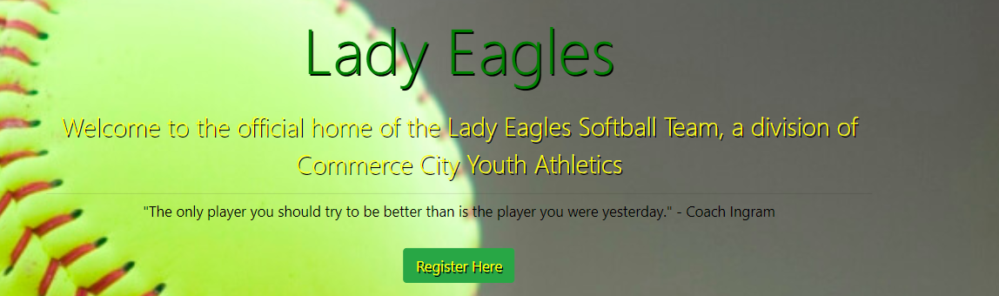
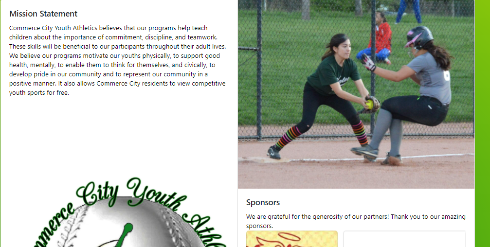

# CCYA 

**COMMERCE CITY YOUTH ATHLETICS**

> AS a parent of a child interested in sports,
  I WANT to have a one-stop site that keeps mine and my child's information safe
  Where I can register my child, view the team schedule
  And send a message directly to the CCYA email.

---

### Table of Contents

- [Description](#description)
- [Technologies](#technologies)
- [How To Use](#how-to-use)
- [License](#license)
- [Author Info](#author-info)

---

## Description

  CCYA is a non-profit sports league headed by Brian Ingram and his family that offers low-cost programs to kids in the Commerce City area. We wanted to create an eye-catching, interactive site for the members. 

### Technologies

- Reactjs
- Reacstrap
- Javascript
- JSON
- Express
- Nodejs
- Passport
- MongoDB
- Mongoose
- HTML
- CSS
- Bootstrap

## How to Use

Click the Start button, the quiz and timer will run as the questions are rendered to the screen, select your answers and your score is printed at the the very end or when the time runs out.

### License

Distributed under the MIT License. See LICENSE for more information.

[Back To The Top](#ccya)

---

## Author Info

Brian Ingram\
Trisha Croatt\
Tyler Mathews\
Grant Pardington\
Fatim Robbins

**Heroku link -** 

